## Exercise 1: Data Ingestion
In this exercise, the goal is to onboard external data like CRM Data in Adobe Experience Platform.

### Learning Objectives

- Learn how to ingest CSV
- Learn how to use Adobe Experience Platform's UI for data ingestion through Workflows

### Lab Resources

- CSV File: demodata.csv (on your desktop)
- Experience Platform UI: [https://platform.adobe.com/](https://platform.adobe.com/)

### Lab Tasks

- Ingest the CSV file in the Adobe Experience Platform UI by making use of the available workflows.

### Exercise 1.1 - Discover the Dataset

For this lab, we'll be using a CSV-file that contains simulated customer data. You can find the CSV-file on the desktop of your computer.

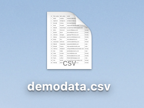

In the CSV-file you'll notice the following fields:

  * id
  * first_name
  * last_name
  * email
  * gender

All these fields have been defined to produce data that is compatible with Platform. 

Open your CSV-file in Microsoft Excel to visualize its contents. Just do a doubleclick on the file to open it.

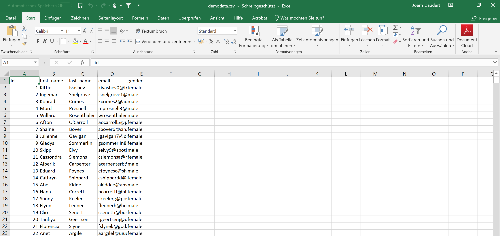

With your CSV-file ready, you can proceed with mapping it against XDM.

### Exercise 1.2 - Verify Datasets in the Platform UI

Open [Adobe Experience Platform's UI](https://platform.adobe.com).

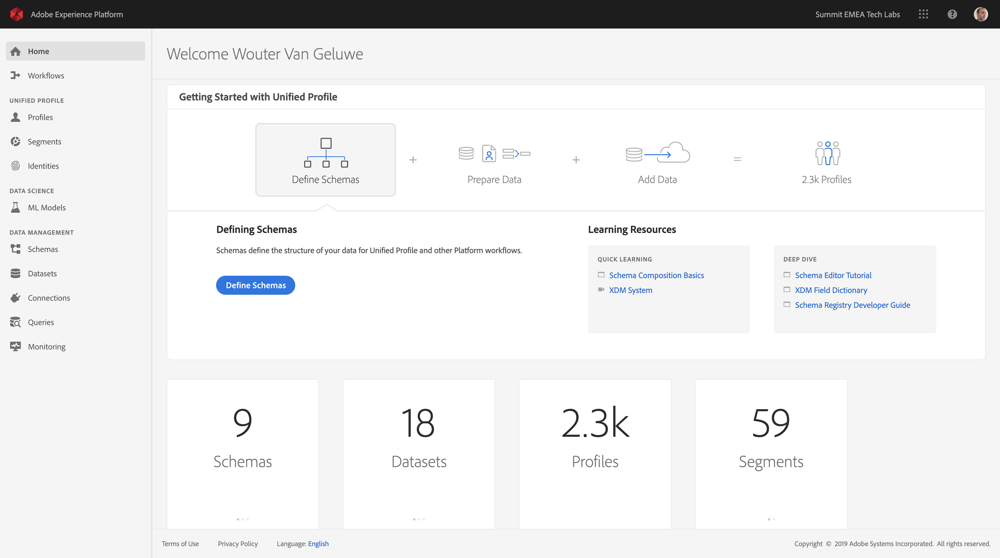

From the left menu, in ```Data Management```, go to ```Datasets```. 

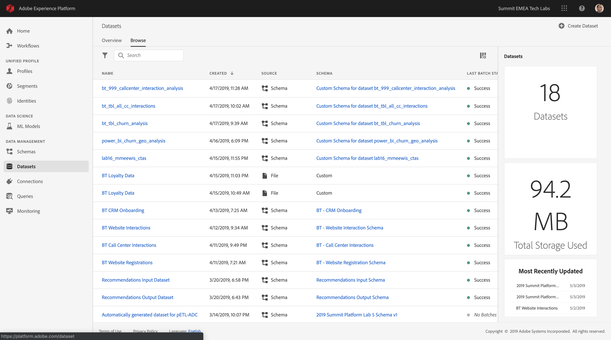

We're going to use a shared dataset based in this enablement. The shared dataset has been created already and is called ```BT CRM Onboarding```. By entering the search term ```CRM``` in the Search box, you'll quickly find the right dataset.


### Exercise 1.3 - Using a workflow to map a CSV file to an XDM Schema

The goal of this exercise is to onboard CRM data in Platform. All the data that is ingested in Platform should be mapped against the specific XDM Schema. What you currently have is a CSV dataset with 1000 lines on the one side, and a dataset that is linked to a schema on the other side. To load that CSV file in that dataset, a mapping exercise needs to take place. To facilitate this mapping exercise, we have ```Workflows``` availabe in Adobe Experience Platform.

From the left menu, select ```Workflows```.

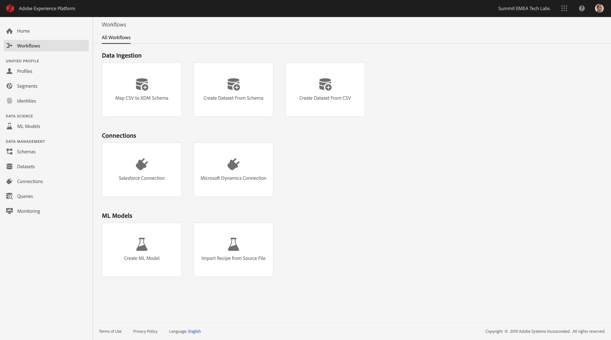

The workflow that we'll use here, is the workflow called "Map CSV to XDM Schema" in the Data Ingestion menu.

Click the "Map CSV to XDM Schema"-button.


Click "Launch" to start the process.


Drag & Drop your CSV-file or click ```Browse``` and navigate on your computer to your desktop and select your CSV-file.

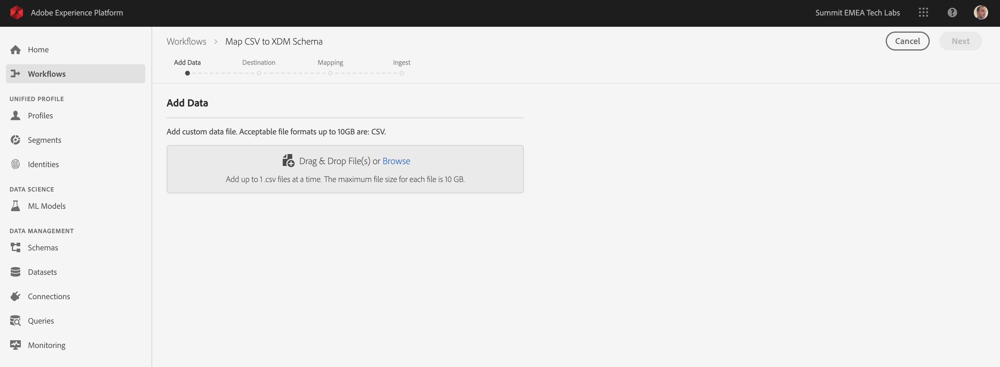

After selecting your CSV-file it will upload immediately and you will see a preview of your file within seconds.

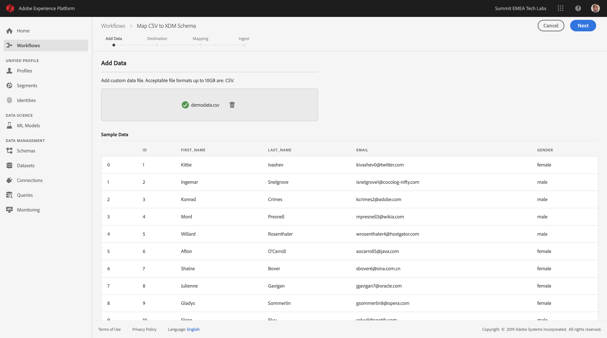

Click ```Next``` to go to the next step. It can take a few seconds while the file is processed completely.


On the next screen, you need to select a dataset to ingest your file in. You have the choice between selecting an already existing dataset or creating a new one. For this exercise, we'll reuse an existing one: please select the ```BT CRM Onboarding```-dataset as indicated below.

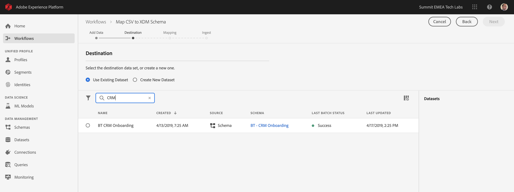

Click ```Next``` to go to the next step.


It's now time to map our CSV Column Headers with an XDM-property in our ```BT CRM Onboarding```-schema.
Based on the CSV Column Headers and the required XDM-Schema, Adobe Experience Platform is already proposing some mappings, by trying to link the Source Attributes with the Target Schema Fields.

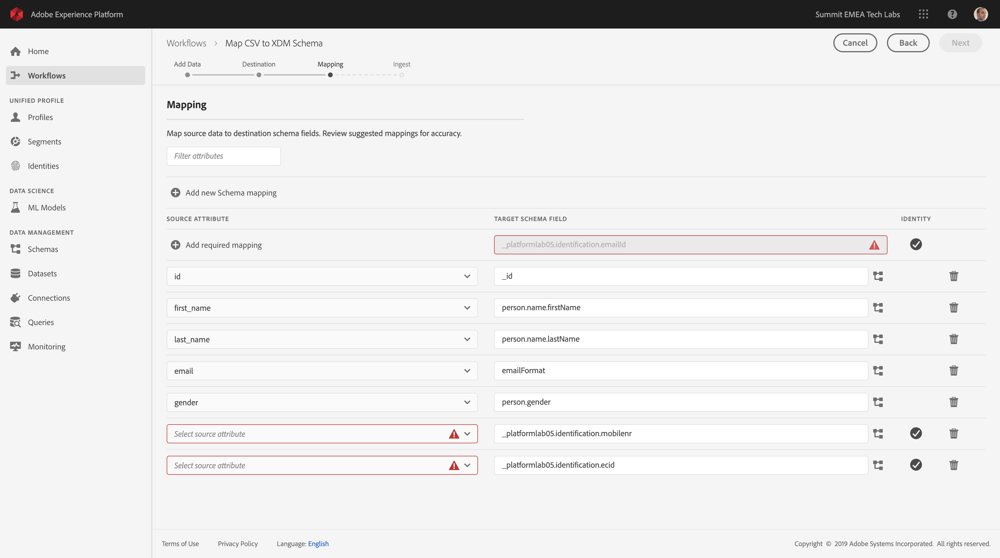

First of all, we need to add the required mapping for the descriptor field. The descriptor field is a required field in this workflow and expects you to indicate what the main identifier is of the file you're uploading. 

Selecting the descriptor is actually the most important thing: you'll be defining the custom, brand-specific, primary identifier. Within Platform-context, we refer to this custom, brand-specific, primary identifier as the descriptor. The descriptor is a requirement for this data to be onboarded. Without the presence of the descriptor, the ingestion of this CSV-file will fail.

Our descriptor for the ```BT CRM Onboarding```-dataset is the ```email``` as it's the unique identifier for our dataset.

In our case, based on the selection of the dataset and the schema that is linked to the dataset, the required Target Schema Field in XDM is ```_platformlab05.identification.emailId```. You need to map the ```email```-field from your CSV file as the source attribute for this required Target Schema Field.

You can start the mapping between those 2 fields by clicking the ```Add required mapping``` - button under ```Source Attribute```.


After clicking the ```Add required mapping``` - button, you now see this:


In the dropdown-list, select ```email```.

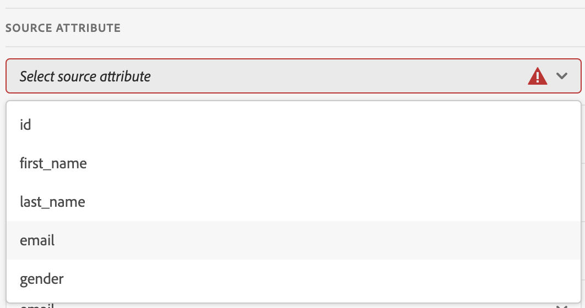

The result should look like this.


Next, you need to verify the mapping for the fields ```first_name```and ```last_name```.
The mapping should look like this:


Next, you need to verify the mapping for the field ```email```. Adobe Experience Platform has made a suggestion, which isn't correct.


The Target Schema Field is set to ```emailFormat```which is incorrect. You need to fix this.

Click on the Schema-icon to open up the UI for our XDM-Schema.


In the **Select Schema Field** - window, search for and click on the field ```personalEmail```. In the field personalEmail, select the field ```address```.

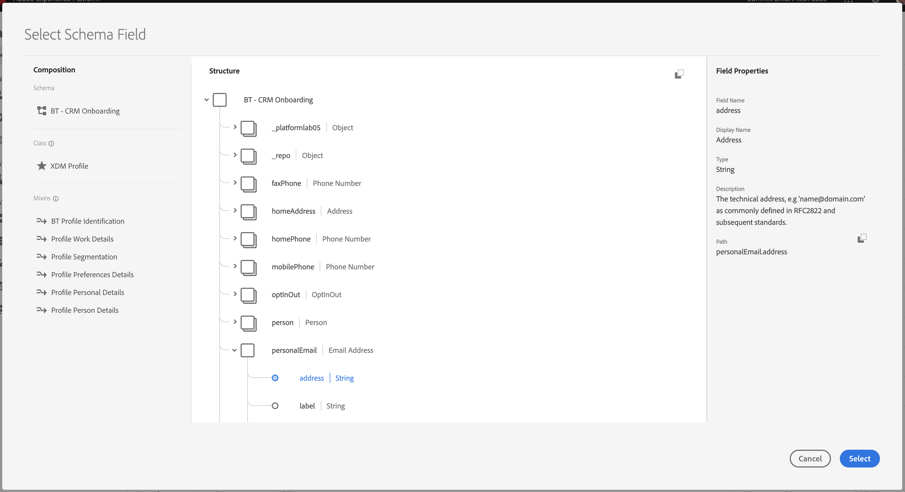

Click ```Select```to confirm your selection.


The result should look like this:


Next, you need to verify the mapping for the field ```gender```.
The mapping should look like this:


Adobe Experience Platform is also proposing to map other identifiers to the fields ```_platformlab05.identification.mobilenr``` and ```_platformlab05.identification.ecid```. 


These fields are optional and we don't need them for the CRM Upload exercise.
So, please delete both these mapping fields by clicking the ```bin```-icon.


The final result of the mapping exercise should look like this:

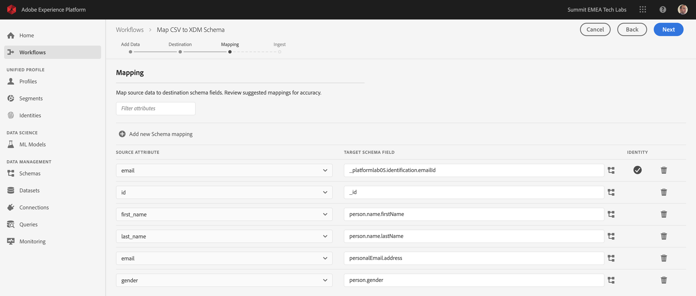

Click ```Next``` to go to the next step.


On the next screen you'll see an overview of what you've done and you can start the ingestion. 

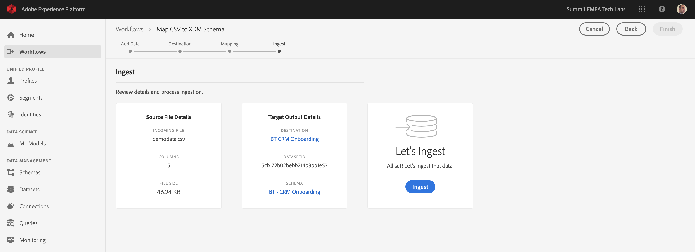

Click the "Ingest"-button.


Ingestion starts and will be running for a number of seconds/minutes (depending on file-size).

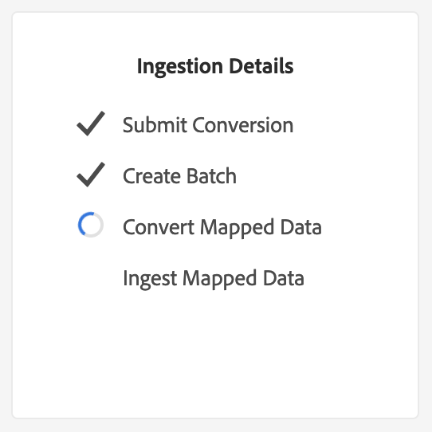

After a couple of minutes, the file will be successfully processed.

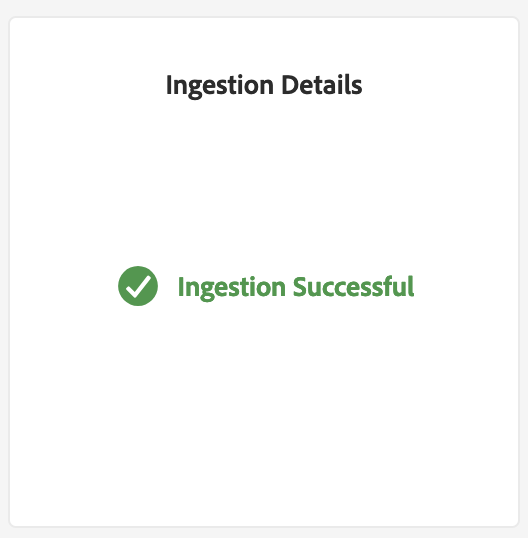

Click the ```Finish```-button to finish the workflow.


After clicking ```Finish```, you're taken to your dataset.

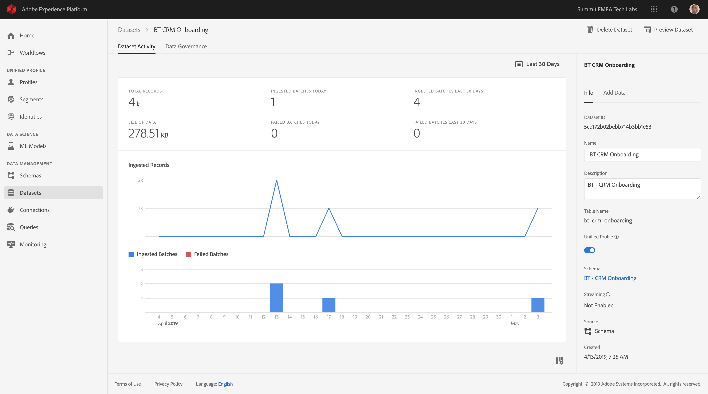

On the dataset, you'll see a Batch ID that was ingested just now, with 20 records ingested and a status of ```Success```.


Click on the ```Preview Dataset```- button to get a quick view of a small sample of the dataset to ensure that the loaded data is correct.


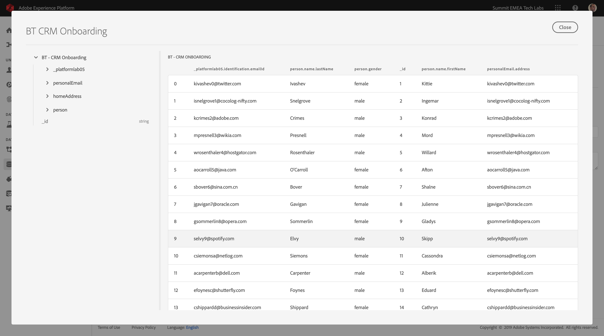

With this, you've now successfully ingested CRM Data in Adobe Experience Platform.

Next Exercise: [Exercise 2 - Real-Time Customer Profile](../unified_profile/README.md) 

[Back to LAB4 Home](../README.md)
