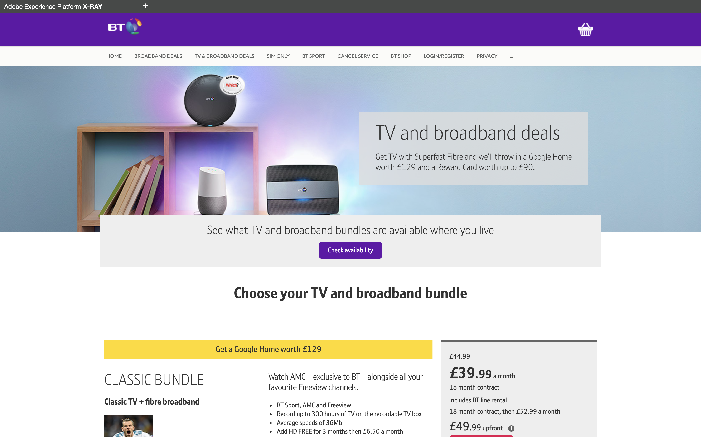

## Exercise 0 - Explore the BT website

In this exercise, you'll explore the BT website that is installed on your local machine.

This site is currently untagged and doesn't send any data to Adobe Experience Platform.

In this Tech Lab, you'll be configuring what is required to capture profile information and customer behavior from this website and stream it to Adobe Experience Platform.

The URL to access the BT website is [http://lab8.bt.com:8888](http://lab8.bt.com:8888).
 
### Exercise 0.1 - Explore BT website

Go to to [http://lab8.bt.com:8888](http://lab8.bt.com:8888).

In the site's menu, click on Broadband Deals to visit that page.

In the site's menu, click on TV & Broadband Deals to visit that page.

Go to the Login/Register page and fill out your own details to register. Click "Create Account" to create your account.

Now that you've seen the website a first time, let's dig into the setup!

---

#### Back to the Overview 
[Overview](./README.md)
