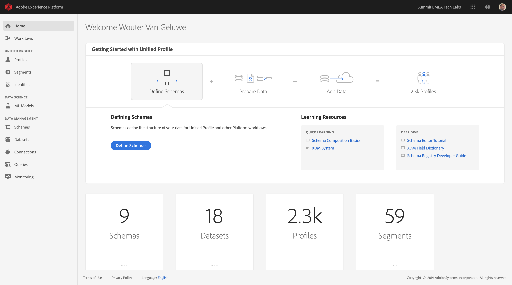
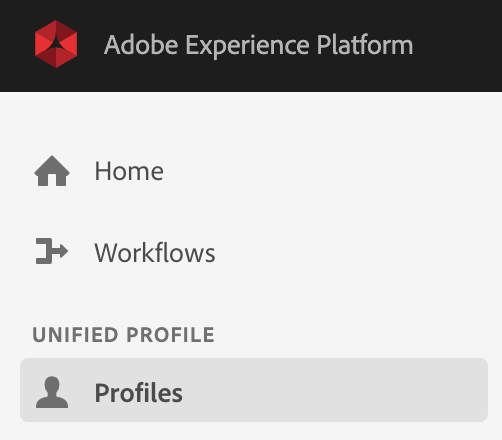
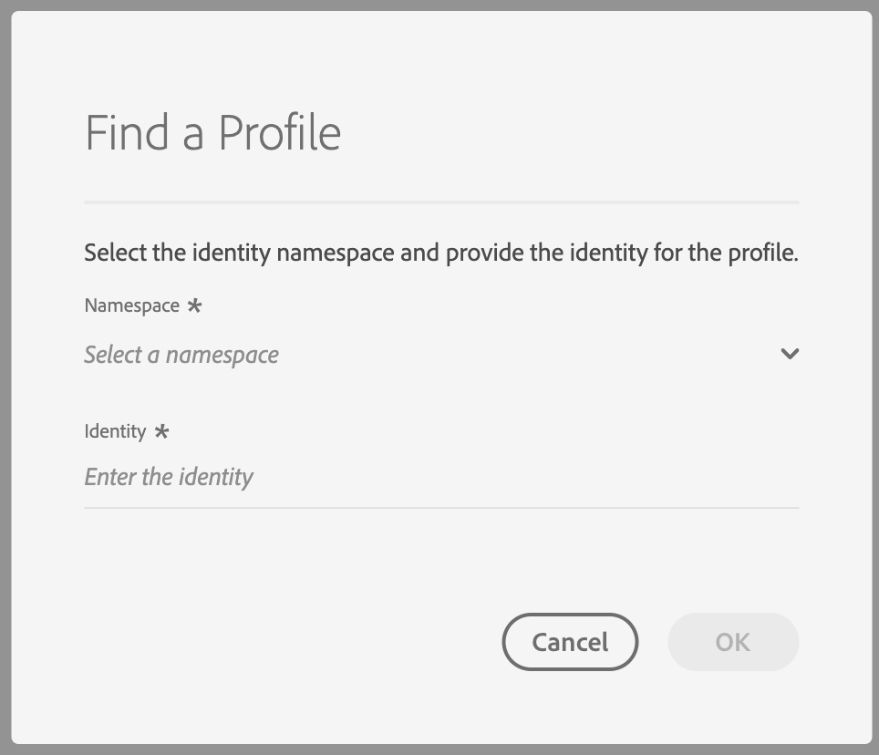
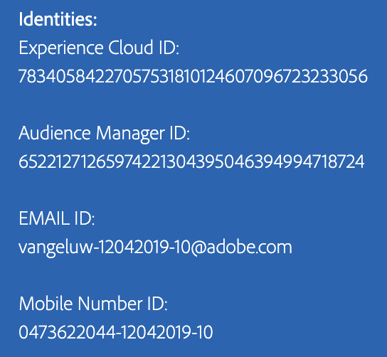
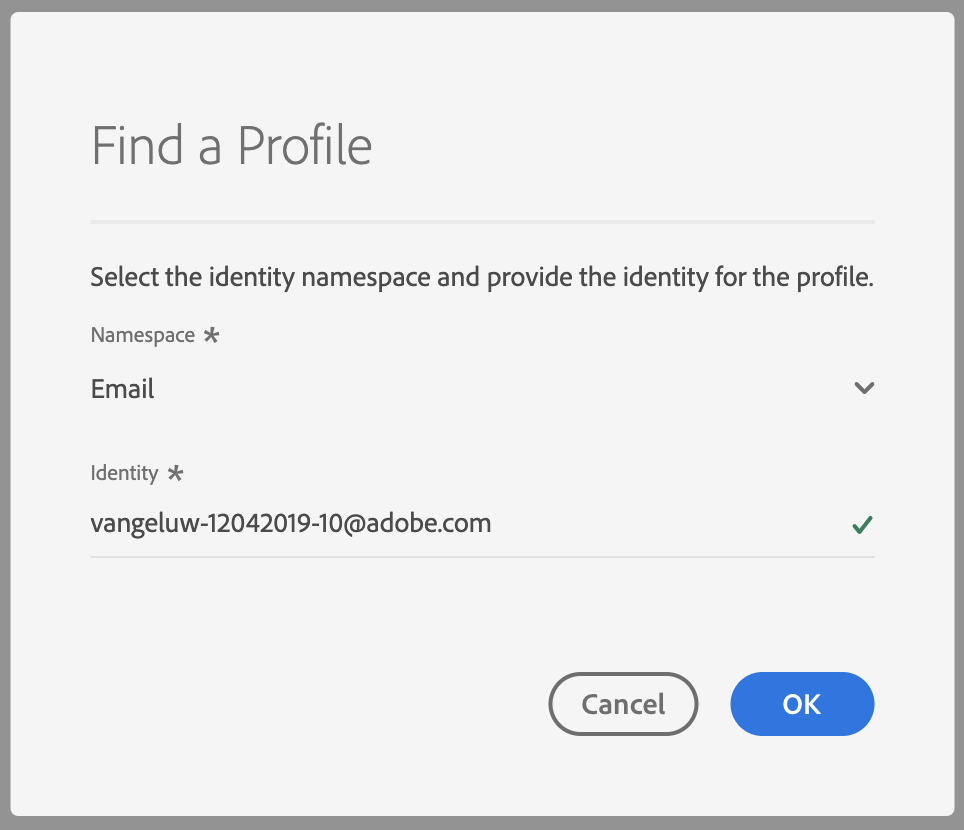
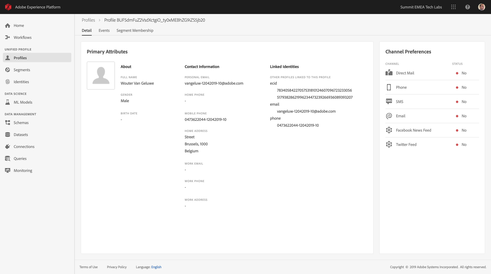
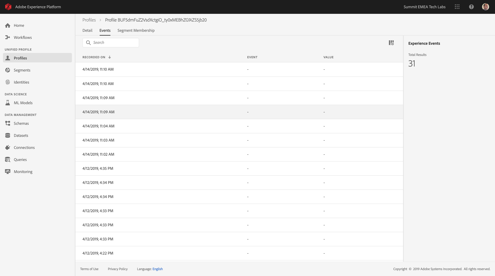

## Exercise 2 - Visualize your own Real-Time Customer Profile - UI

In this exercise, you'll login to Adobe Experience Platform and you'll view your own Real-Time Customer Profile in the UI.

The URL to login to Adobe Experience Platform is: [https://platform.adobe.com](https://platform.adobe.com)
 
### Story

In the real-time customer profile, all profile data is shown alongside behavioral and transactional data and the view will also be enriched with existing segment memberships. The data that is shown here comes from anywhere, from any Adobe solution to any external solution. This is the most powerful view of Adobe Experience Platform: the true Experience System of Record.

### Exercise 2.1 - Use the Customer Profile View in Adobe Experience Platform

In Adobe Experience Platform there's a new feature of visualizing the entire real-time customer profile. This one feature is what all of our customer's have been trying to get for years: a single view of the customer.

Go to the Platform UI: [https://platform.adobe.com/home](https://platform.adobe.com/home).



In the menu on the left side, go to ```Profiles```.



Click on ```Find a Profile```.


By clicking on "Find a Profile", a popup appears in which a namespace and an ID can be entered. 



On the X-ray panel on your local BT website, you can find multiple identities. Every Identity is linked to a namespace. 



On the X-ray panel, we can see 4 different combinations of ID's and Namespaces:


| Identity     | Namespace       |
|:-------------:| :---------------:|
| Experience Cloud ID (ECID)          | 78340584227057531810124607096723233056 |
| Audience Manager ID          | 65221271265974221304395046394994718724 |
| Email ID          | vangeluw-12042019-10@adobe.com |
| Mobile Number ID          | 0473622044-12042019-10 |

With Adobe Experience Platform, all these ID's are as important as the other. Previously, before Adobe Experience Platform, the ECID was the most important ID in the Adobe context and all other ID's were linked to the ECID in a hierarchical relation. 
With Adobe Experience Platform this is no longer the case, and every ID can be considered a primary identifier. Whether it really is the Primary Identifier is dependant of the solution you ask: if you ask the BT Call Center what the most important ID is, they will say: the mobile number. But if you ask the CRM team what the most important ID is, the answer will be the email-address. The thing is: Adobe Experience Platform understands this complexity and takes it away from you. Every solution, whether it's an Adobe solution or an external solution, will speak with Adobe Experience Platform by referring the ID they consider to be primary. And that simply works.

In this case, I'm taking my Email ID (vangeluw-12042019-10@adobe.com), and selecting the namespace of ```Email```.
You should do the same and specify your Email ID, the Email ID that you used to register on your local BT website in the previous exercise.



By clicking OK, you'll see your full, real-time customer profile.



And by going to the menu option ```Events```, you can see records for every Experience Event that is linked to your Profile.



---

Next Exercise: [Exercise 3 - Query Service](../query_service/README.md) 

[Back to LAB4 Home](../README.md)